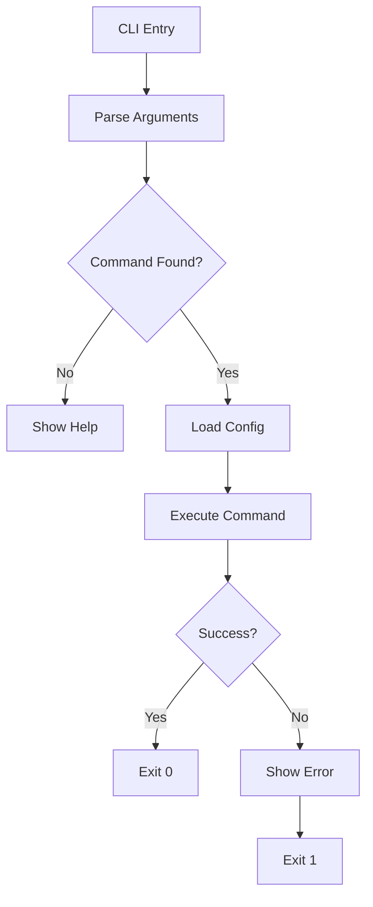
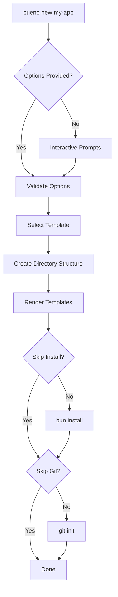
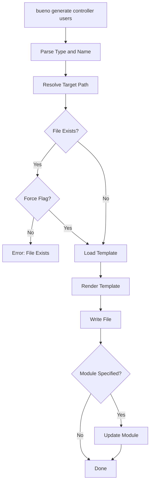
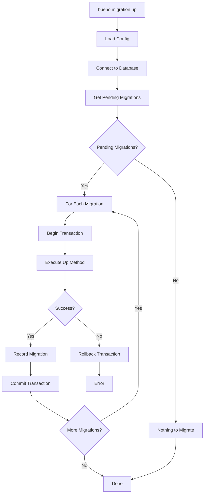

# Bueno CLI Architecture

**Version:** 1.0.0  
**Last Updated:** 2026-02-17

---

## Executive Summary

The Bueno CLI provides a comprehensive command-line interface for the Bueno framework, enabling developers to scaffold projects, generate code, manage migrations, and control development/production workflows. Built using Bun's native capabilities without external CLI libraries, it follows the framework's philosophy of zero configuration and batteries-included development experience.

---

## 1. Design Principles

### 1.1 Core Principles

- **Bun-Native**: Use Bun's built-in APIs for all operations (file system, process management, transpilation)
- **Zero External Dependencies**: No third-party CLI libraries (commander, yargs, etc.)
- **Type-Safe**: Full TypeScript support with proper typing for all commands and options
- **Progressive Enhancement**: Simple defaults with optional advanced configuration
- **Consistent API**: Uniform command structure and option naming across all commands

### 1.2 Integration Philosophy

- **Framework-Aware**: CLI understands the module system, decorators, and project structure
- **Template-Driven**: All code generation uses customizable templates
- **Configuration-Respectful**: Reads `bueno.config.ts` when available
- **Non-Destructive**: Never overwrite existing files without explicit confirmation

---

## 2. Command Structure

### 2.1 Command Overview

```
bueno <command> [options] [arguments]

Commands:
  bueno new <project>        Create a new Bueno project
  bueno generate <type> <name>  Generate code artifacts
  bueno migration <action>   Manage database migrations
  bueno dev                  Start development server
  bueno build                Build for production
  bueno start                Start production server
  bueno help [command]       Show help information
  bueno version              Show CLI version
```

### 2.2 Command Details

#### `bueno new <project-name>`

Create a new Bueno project with scaffolding.

**Usage:**
```bash
bueno new my-app
bueno new my-api --template minimal
bueno new my-fullstack --template fullstack
```

**Options:**
| Option | Alias | Default | Description |
|--------|-------|---------|-------------|
| `--template` | `-t` | `default` | Project template (default, minimal, fullstack, api) |
| `--framework` | `-f` | `react` | Frontend framework (react, vue, svelte, solid) |
| `--database` | `-d` | `sqlite` | Database driver (sqlite, postgresql, mysql) |
| `--skip-install` | | `false` | Skip dependency installation |
| `--skip-git` | | `false` | Skip git initialization |
| `--yes` | `-y` | `false` | Use default options without prompts |

**Templates:**
- `default`: Standard project with modules, database, and basic frontend
- `minimal`: Bare minimum project structure
- `fullstack`: Full-stack project with SSR, authentication, and frontend
- `api`: API-only project without frontend

---

#### `bueno generate <type> <name>`

Generate code artifacts (controllers, services, modules, etc.).

**Usage:**
```bash
bueno generate controller users
bueno generate service auth
bueno generate module posts
bueno g guard auth-guard
```

**Shortcuts:**
- `g` is an alias for `generate`

**Types:**
| Type | Short | Description |
|------|-------|-------------|
| `controller` | `c` | Generate a controller |
| `service` | `s` | Generate a service/injectable |
| `module` | `m` | Generate a module |
| `guard` | `gu` | Generate a guard |
| `interceptor` | `i` | Generate an interceptor |
| `pipe` | `p` | Generate a pipe |
| `filter` | `f` | Generate an exception filter |
| `dto` | `d` | Generate a DTO class |
| `middleware` | `mw` | Generate a middleware |
| `migration` | `mi` | Generate a migration file |

**Options:**
| Option | Alias | Default | Description |
|--------|-------|---------|-------------|
| `--module` | `-m` | | Parent module to register with |
| `--path` | | | Custom path for controller routes |
| `--dry-run` | | `false` | Show what would be created without writing |
| `--force` | | `false` | Overwrite existing files |

**Examples:**
```bash
# Generate a users controller in the users module
bueno g controller users --module users

# Generate an auth guard
bueno g guard auth --module auth

# Generate a DTO for creating users
bueno g dto create-user --module users
```

---

#### `bueno migration <action>`

Manage database migrations.

**Usage:**
```bash
bueno migration create add-users-table
bueno migration up
bueno migration down
bueno migration status
```

**Actions:**
| Action | Description |
|--------|-------------|
| `create <name>` | Create a new migration file |
| `up` | Run pending migrations |
| `down` | Rollback last migration |
| `reset` | Rollback all migrations |
| `refresh` | Reset and re-run all migrations |
| `status` | Show migration status |

**Options:**
| Option | Alias | Default | Description |
|--------|-------|---------|-------------|
| `--steps` | `-n` | `1` | Number of migrations to rollback |
| `--dry-run` | | `false` | Show what would happen without executing |
| `--seed` | | `false` | Run seeds after migration |

**Examples:**
```bash
# Create a new migration
bueno migration create add-users-table

# Run all pending migrations
bueno migration up

# Rollback last 3 migrations
bueno migration down --steps 3

# Reset and re-run all migrations
bueno migration refresh
```

---

#### `bueno dev`

Start the development server with hot reload.

**Usage:**
```bash
bueno dev
bueno dev --port 4000
bueno dev --hmr
```

**Options:**
| Option | Alias | Default | Description |
|--------|-------|---------|-------------|
| `--port` | `-p` | `3000` | Server port |
| `--host` | `-H` | `localhost` | Server hostname |
| `--hmr` | | `true` | Enable hot module replacement |
| `--watch` | `-w` | `true` | Watch for file changes |
| `--console` | | `true` | Enable browser console streaming |
| `--open` | `-o` | `false` | Open browser on start |
| `--config` | `-c` | | Path to config file |

**Examples:**
```bash
# Start dev server on default port
bueno dev

# Start on port 4000 with custom config
bueno dev --port 4000 --config ./bueno.config.ts

# Start without HMR
bueno dev --no-hmr
```

---

#### `bueno build`

Build the application for production.

**Usage:**
```bash
bueno build
bueno build --target bun
bueno build --target node
```

**Options:**
| Option | Alias | Default | Description |
|--------|-------|---------|-------------|
| `--target` | `-t` | `bun` | Build target (bun, node, standalone) |
| `--outdir` | `-o` | `./dist` | Output directory |
| `--minify` | | `true` | Minify output |
| `--sourcemap` | | `false` | Generate source maps |
| `--analyze` | | `false` | Analyze bundle size |
| `--config` | `-c` | | Path to config file |

**Examples:**
```bash
# Build for Bun runtime
bueno build

# Build standalone executable
bueno build --target standalone

# Build with source maps
bueno build --sourcemap
```

---

#### `bueno start`

Start the production server.

**Usage:**
```bash
bueno start
bueno start --port 8080
```

**Options:**
| Option | Alias | Default | Description |
|--------|-------|---------|-------------|
| `--port` | `-p` | `3000` | Server port |
| `--host` | `-H` | `0.0.0.0` | Server hostname |
| `--workers` | `-w` | `auto` | Number of worker threads |
| `--config` | `-c` | | Path to config file |

---

### 2.3 Global Options

Available for all commands:

| Option | Description |
|--------|-------------|
| `--help` | Show help for command |
| `--version` | Show CLI version |
| `--verbose` | Enable verbose output |
| `--quiet` | Suppress non-essential output |
| `--no-color` | Disable colored output |
| `--config` | Path to config file |

---

## 3. File Organization

### 3.1 CLI Module Structure

```
src/cli/
├── index.ts                 # CLI entry point and command router
├── ARCHITECTURE.md          # This document
│
├── commands/                # Command implementations
│   ├── index.ts             # Command registry
│   ├── new.ts               # Project scaffolding
│   ├── generate.ts          # Code generation
│   ├── migration.ts         # Migration management
│   ├── dev.ts               # Development server
│   ├── build.ts             # Production build
│   ├── start.ts             # Production server
│   └── help.ts              # Help display
│
├── core/                    # Core CLI utilities
│   ├── args.ts              # Argument parser
│   ├── console.ts           # Console output utilities
│   ├── prompt.ts            # Interactive prompts
│   ├── spinner.ts           # Progress spinners
│   └── config.ts            # CLI config loader
│
├── generators/              # Code generators
│   ├── index.ts             # Generator registry
│   ├── controller.ts        # Controller generator
│   ├── service.ts           # Service generator
│   ├── module.ts            # Module generator
│   ├── guard.ts             # Guard generator
│   ├── interceptor.ts       # Interceptor generator
│   ├── pipe.ts              # Pipe generator
│   ├── filter.ts            # Filter generator
│   ├── dto.ts               # DTO generator
│   ├── middleware.ts        # Middleware generator
│   └── migration.ts         # Migration generator
│
└── utils/                   # Utility functions
    ├── fs.ts                # File system utilities
    ├── strings.ts           # String manipulation
    ├── paths.ts             # Path utilities
    └── validation.ts        # Input validation
```

### 3.2 Generated Project Structure

When running `bueno new <project>`, the following structure is created:

```
my-app/
├── server/
│   ├── main.ts                    # Application entry point
│   ├── app.module.ts              # Root module
│   │
│   ├── modules/                   # Feature modules
│   │   └── app/
│   │       ├── app.module.ts
│   │       ├── app.controller.ts
│   │       └── app.service.ts
│   │
│   ├── common/                    # Shared utilities
│   │   ├── middleware/
│   │   ├── decorators/
│   │   ├── filters/
│   │   ├── guards/
│   │   ├── interceptors/
│   │   └── pipes/
│   │
│   ├── config/                    # Configuration
│   │   └── database.config.ts
│   │
│   └── database/                  # Database assets
│       ├── migrations/
│       └── seeds/
│
├── client/                        # Frontend (if applicable)
│   ├── index.html
│   └── src/
│       ├── main.tsx
│       └── components/
│
├── tests/                         # Test files
│   ├── unit/
│   └── integration/
│
├── bueno.config.ts                # Framework configuration
├── package.json
├── tsconfig.json
└── .env.example
```

---

## 4. Template System

### 4.1 Dynamic Template Generation

The CLI uses a dynamic template generation approach via TypeScript functions in [`commands/new.ts`](src/cli/commands/new.ts). Instead of static template files, templates are generated programmatically at runtime, providing several advantages:

- **No external files to maintain**: All templates are self-contained in the codebase
- **Type-safe**: Templates benefit from TypeScript type checking
- **Easier version control**: Templates are part of the source code, not separate files
- **Dynamic customization**: Templates can adapt based on project configuration
- **Simpler debugging**: Template code is regular TypeScript with full IDE support

### 4.2 Template Functions

The following functions in [`commands/new.ts`](src/cli/commands/new.ts) generate project files:

| Function | File Generated | Purpose |
|----------|---------------|---------|
| [`getPackageJsonTemplate()`](src/cli/commands/new.ts:75) | `package.json` | Generates npm package configuration with dependencies based on template type |
| [`getTsConfigTemplate()`](src/cli/commands/new.ts:117) | `tsconfig.json` | Generates TypeScript configuration |
| [`getMainTemplate()`](src/cli/commands/new.ts:144) | `server/main.ts` | Generates application entry point with controller/service/module based on template |
| [`getConfigTemplate()`](src/cli/commands/new.ts:201) | `bueno.config.ts` | Generates framework configuration with database settings |
| [`getEnvExampleTemplate()`](src/cli/commands/new.ts:233) | `.env.example` | Generates environment variable template |
| [`getGitignoreTemplate()`](src/cli/commands/new.ts:249) | `.gitignore` | Generates git ignore patterns |
| [`getReadmeTemplate()`](src/cli/commands/new.ts:288) | `README.md` | Generates project documentation |

### 4.3 Template Types

The CLI supports four project templates, selected via `--template` or `-t` option:

| Template | Description | Features |
|----------|-------------|----------|
| `default` | Standard project with modules, database, and basic frontend | Controllers, Services, Modules, Database config, Zod |
| `minimal` | Bare minimum project structure | Simple server with router, no decorators |
| `fullstack` | Full-stack project with SSR and frontend | Full framework features with frontend integration |
| `api` | API-only project without frontend | Controllers, Services, Database, no frontend |

### 4.4 Template Customization

Templates adapt based on the project configuration:

- **Database selection**: Template functions check `config.database` to include appropriate connection strings
- **Template type**: Different code is generated for `minimal` vs full framework projects
- **Project name**: All templates use the project name for package.json, README, etc.

Example from [`getMainTemplate()`](src/cli/commands/new.ts:144):
```typescript
function getMainTemplate(config: ProjectConfig): string {
  if (config.template === 'minimal') {
    // Simple router-based approach
    return `import { createServer } from 'bueno';
const app = createServer();
app.router.get('/', () => {
  return { message: 'Hello, Bueno!' };
});
await app.listen(3000);`;
  }
  // Full framework approach with decorators
  return `import { createApp, Module, Controller, Get, Injectable } from 'bueno';
// ... full module structure with @Controller, @Injectable, etc.
await createApp(AppModule).listen(3000);`;
}
```

### 4.5 Future: Static Template Support

The architecture allows for future expansion to support static template files if needed. The current dynamic approach can coexist with file-based templates for custom user templates.

---

## 5. Integration Points

### 5.1 Module System Integration

The CLI integrates with the existing module system:

**Module Registration:**
When generating a controller or service, the CLI:
1. Reads the target module file
2. Parses the `@Module()` decorator metadata
3. Adds the new controller/service to the appropriate array
4. Preserves formatting and imports

**Example - Adding Controller to Module:**
```typescript
// Before
@Module({
  controllers: [UsersController],
  providers: [UsersService],
})
export class UsersModule {}

// After running: bueno g controller posts --module users
@Module({
  controllers: [UsersController, PostsController],
  providers: [UsersService],
})
export class UsersModule {}
```

### 5.2 Database Integration

**Migration System:**
- Uses existing [`MigrationRunner`](src/database/migrations/index.ts:38) class
- Generates migration files with proper naming convention
- Integrates with [`generateMigrationId()`](src/database/migrations/index.ts:361)

**Migration File Template:**
```typescript
import { createMigration, type MigrationRunner } from 'bueno';

export default createMigration('{{migrationId}}', '{{migrationName}}')
  .up(async (db: MigrationRunner) => {
    // TODO: Add migration logic
    await db.createTable({
      name: '{{tableName}}',
      columns: [
        // Define columns
      ],
    });
  })
  .down(async (db: MigrationRunner) => {
    // TODO: Add rollback logic
    await db.dropTable('{{tableName}}');
  });
```

### 5.3 Configuration Integration

**Config Loading:**
- Reads [`bueno.config.ts`](src/config/index.ts) for default values
- CLI options override config file values
- Environment variables are respected

**Config Schema Extension:**
```typescript
// bueno.config.ts
export default defineConfig({
  cli: {
    // CLI-specific configuration
    templatesDir: '.bueno/templates',
    defaultModule: 'app',
    generate: {
      spec: true,  // Generate test files
      flat: false, // Use flat structure
    },
  },
  
  // Existing config
  server: { port: 3000 },
  database: { url: process.env.DATABASE_URL },
});
```

### 5.4 Development Server Integration

**Dev Command Integration:**
- Uses existing [`DevServer`](src/frontend/dev-server.ts:142) class
- Integrates with [`HMRManager`](src/frontend/dev-server.ts:151)
- Supports [`ConsoleStreamManager`](src/frontend/dev-server.ts:152)

### 5.5 Logger Integration

Uses the existing [`Logger`](src/logger/index.ts) system for consistent output:

```typescript
import { createLogger } from '../logger';

const logger = createLogger({
  level: 'debug',
  pretty: true,
  context: { component: 'CLI' },
});
```

---

## 6. Implementation Approach

### 6.1 Phase 1: Core Infrastructure

1. **Argument Parser** (`core/args.ts`)
   - Parse command line arguments using `process.argv`
   - Support for positional arguments, flags, and options
   - Auto-generate help text from command definitions

2. **Console Utilities** (`core/console.ts`)
   - Colored output using ANSI codes
   - Formatted tables, lists, and trees
   - Progress indicators and spinners

3. **Interactive Prompts** (`core/prompt.ts`)
   - Text input, confirm, select, multi-select
   - Validation and default values
   - Graceful fallback for non-TTY environments

### 6.2 Phase 2: Scaffolding

1. **Dynamic Template Functions** (`commands/new.ts`)
   - Template functions generate project files programmatically
   - Supports 4 template types: default, minimal, fullstack, api
   - Templates adapt based on project configuration (database, framework)
   - Post-generation hooks (bun install, git init)

2. **New Command** (`commands/new.ts`)
   - Interactive project creation with prompts
   - Template selection and customization
   - Project validation and directory creation
   - Dependency installation using `bun install`

### 6.3 Phase 3: Code Generation

1. **Generator Base Class** (`generators/index.ts`)
   - Abstract base for all generators
   - Template rendering and file writing
   - Module registration logic

2. **Individual Generators** (`generators/*.ts`)
   - Controller, Service, Module generators
   - Guard, Interceptor, Pipe, Filter generators
   - DTO and Middleware generators

3. **Generate Command** (`commands/generate.ts`)
   - Parse generator type and name
   - Resolve options and execute generator
   - Output created files summary

### 6.4 Phase 4: Migration Commands

1. **Migration Generator** (`generators/migration.ts`)
   - Create migration files with timestamp IDs
   - Template for up/down methods

2. **Migration Command** (`commands/migration.ts`)
   - Execute migrations using existing `MigrationRunner`
   - Status display and rollback support

### 6.5 Phase 5: Dev/Build/Start

1. **Dev Command** (`commands/dev.ts`)
   - Start `DevServer` with options
   - File watching and restart logic
   - Integration with HMR and console streaming

2. **Build Command** (`commands/build.ts`)
   - Use `bun build` with configuration
   - Target-specific builds (bun, node, standalone)
   - Bundle analysis and optimization

3. **Start Command** (`commands/start.ts`)
   - Production server startup
   - Worker thread management
   - Graceful shutdown handling

---

## 7. CLI Flow Diagrams

### 7.1 Command Execution Flow



### 7.2 Project Scaffolding Flow



### 7.3 Code Generation Flow



### 7.4 Migration Flow



---

## 8. Error Handling

### 8.1 Error Types

```typescript
// Error categories
enum CLIErrorType {
  INVALID_ARGS = 'INVALID_ARGS',
  FILE_EXISTS = 'FILE_EXISTS',
  FILE_NOT_FOUND = 'FILE_NOT_FOUND',
  MODULE_NOT_FOUND = 'MODULE_NOT_FOUND',
  TEMPLATE_ERROR = 'TEMPLATE_ERROR',
  DATABASE_ERROR = 'DATABASE_ERROR',
  NETWORK_ERROR = 'NETWORK_ERROR',
  PERMISSION_ERROR = 'PERMISSION_ERROR',
}
```

### 8.2 Error Display

- Clear, actionable error messages
- Suggested fixes when possible
- Stack traces only in verbose mode
- Color-coded severity (red for errors, yellow for warnings)

---

## 9. Testing Strategy

### 9.1 Unit Tests

- Test each command in isolation
- Mock file system operations
- Template rendering tests
- Argument parsing tests

### 9.2 Integration Tests

- End-to-end command execution
- Generated file validation
- Module registration verification

### 9.3 Test Utilities

```typescript
// Test helper for CLI commands
async function runCommand(args: string[]): Promise<{
  exitCode: number;
  stdout: string;
  stderr: string;
  files: Map<string, string>;
}>
```

---

## 10. Future Enhancements

### 10.1 Planned Features

- **Plugin System**: Allow third-party CLI extensions
- **Interactive Mode**: Full TUI for project management
- **Update Checker**: Notify when new version available
- **Telemetry**: Optional usage analytics
- **Autocomplete**: Shell completion for commands

### 10.2 Potential Extensions

- `bueno addon <action>` - Manage addons/plugins
- `bueno info` - Show project diagnostics
- `bueno update` - Update framework version
- `bueno deploy` - Deployment helpers

---

## 11. Appendix

### 11.1 Exit Codes

| Code | Meaning |
|------|---------|
| 0 | Success |
| 1 | General error |
| 2 | Invalid arguments |
| 3 | File system error |
| 4 | Database error |
| 5 | Network error |
| 130 | Interrupted (Ctrl+C) |

### 11.2 Environment Variables

| Variable | Description |
|----------|-------------|
| `BUENO_CONFIG` | Path to config file |
| `BUENO_NO_COLOR` | Disable colored output |
| `BUENO_VERBOSE` | Enable verbose output |
| `BUENO_TEMPLATES_DIR` | Custom templates directory |

### 11.3 Configuration Schema

```typescript
interface BuenoCLIConfig {
  templatesDir?: string;
  defaultModule?: string;
  generate?: {
    spec?: boolean;
    flat?: boolean;
    path?: string;
  };
  migration?: {
    dir?: string;
    table?: string;
  };
}
```

---

## Conclusion

This CLI architecture provides a comprehensive, Bun-native solution for Bueno framework development. By leveraging Bun's built-in capabilities and integrating deeply with the existing module system, the CLI delivers a seamless developer experience while maintaining the framework's core principles of performance, type safety, and zero configuration.